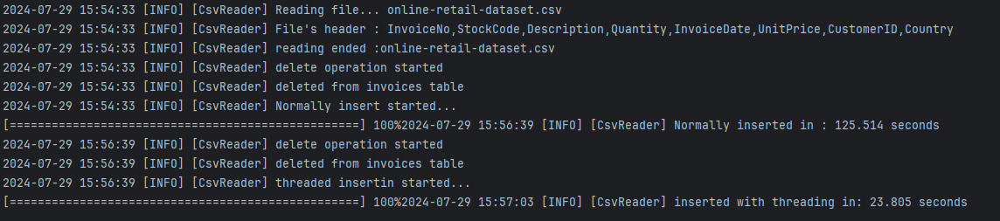

# Insert DB with Threading

This project demonstrates how to read data from a CSV file and insert it into a database using Java. The project includes a performance comparison between inserting data sequentially and using multiple threads. 

## Features

- Read data from a CSV file
- Insert data into a database sequentially
- Insert data into a database using multiple threads
- Measure and log the time taken for both sequential and threaded insertions
- Display a progress bar to track the insertion process

## Requirements

- Java 17 or later
- Maven 3.6.0 or later
- MySQL Database

## Setup

1. **Clone the repository:**

    ```sh
    git clone https://github.com/RamazanAkdag/Insert-Db-with-Threading.git
    cd Insert-Db-with-Threading
    ```

2. **Configure the database:**

    Ensure you have a MySQL database running and create a database for this project. Update the database connection settings in `application.properties`.

    ```properties
    db.url=jdbc:mysql://localhost:3306/yourdatabase
    db.user=yourusername
    db.password=yourpassword
    ```

3. **Build the project:**

    ```sh
    mvn clean install
    ```

4. **Run the application:**

    ```sh
    java -jar target/your-jar-file.jar
    ```

## How It Works

### Reading Data from CSV

The `CsvReader` class reads data from a CSV file line by line and converts each line into an `Invoice` object.

### Inserting Data Sequentially

In the main method, the data is first inserted into the database sequentially. The time taken for this operation is measured and logged.

### Inserting Data Using Threads

The `InsertThreadManager` class manages the insertion of data using multiple threads. Each thread is responsible for inserting a subset of the data. The time taken for this operation is also measured and logged.

### Progress Bar

A progress bar is displayed in the console to show the progress of the insertion process. The progress bar is updated in real-time for both sequential and threaded insertions.

## Example Output

Here is an example output of the application running:



## Classes and Methods

### `App`

The main class where the application starts. It reads the CSV file, deletes any existing data in the database, and performs both sequential and threaded insertions, logging the time taken for each.

### `CsvReader`

Contains the `readFileByLineToInvoice` method which reads the CSV file and returns a list of `Invoice` objects.

### `InsertThreadManager`

Manages the threaded insertion of data. It uses a fixed thread pool to insert data into the database concurrently.

### `InvoiceDal`

Contains the methods to insert and delete invoices in the database.

### `Logger`

A custom logger class that logs messages to the console and a log file. It supports logging at different levels (INFO, DEBUG, WARN, ERROR) and includes the class context in the log messages. It also supports asynchronous logging using a single-threaded executor.

### `ProgressBar`

Displays a progress bar in the console to track the progress of the insertion process.

## Usage

1. **Run the application:**

    ```sh
    java -jar target/your-jar-file.jar
    ```

2. **View the logs:**

    The logs are displayed in the console and written to `app.log`.

3. **Check the database:**

    Verify that the data has been inserted into the database by querying the database.

## License

This project is licensed under the MIT License - see the [LICENSE](LICENSE) file for details.

## Acknowledgments

- Thanks to all contributors and the open-source community.
- Special thanks to the developers of the libraries and tools used in this project.

